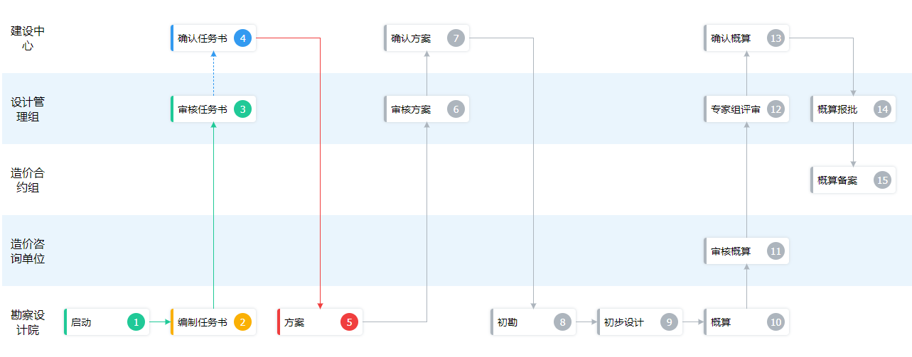

# Flow Path

A vue3 component that can quickly create flowcharts.



## Install

```sh
yarn add flow-path
```

## Usage

```vue
<template>
  <FlowPath :nodes="nodes" :role-order="roleOrder"></FlowPath>
</template>

<script setup lang="ts">
import { defineComponent } from 'vue'

import { FlowPath } from 'flow-path'

import type { NodeOptions } from 'flow-path'

const nodes: NodeOptions[] = [
  { id: 1, name: 'Start', role: 'role5', nextId: 2, state: 'success' },
  { id: 2, name: 'Compile mission', role: 'role5', nextId: 3, state: 'success', problem: '5 day later' },
  { id: 3, name: 'Review mission', role: 'role2', nextId: 4, state: 'success' },
  { id: 4, name: 'Confirm mission', role: 'role1', nextId: 5, state: 'pending' },
  { id: 5, name: 'Plan', role: 'role5', nextId: 6, state: 'fail' },
  { id: 6, name: 'Review plan', role: 'role2', nextId: 7 },
  { id: 7, name: 'Confirm plan', role: 'role1', nextId: 8 },
  { id: 8, name: 'Survey', role: 'role5', nextId: 9 },
  { id: 9, name: 'Design', role: 'role5', nextId: 10 },
  { id: 10, name: 'Estimate', role: 'role5', nextId: 11 },
  { id: 11, name: 'Review estimate', role: 'role4', nextId: 12 },
  { id: 12, name: 'Expert evaluation', role: 'role2', nextId: 13 },
  { id: 13, name: 'Confirm estimate', role: 'role1', nextId: 14 },
  { id: 14, name: 'Report estimate', role: 'role2', nextId: 15 },
  { id: 15, name: 'file', role: 'role3' }
]

const roleOrder = ['role1', 'role2', 'role3', 'role4', 'role5']
</script>
```

## Props

```ts
import type { PropType } from 'vue'

type Key = string | number
type NodeState = 'success' | 'fail' | 'pending' | 'waiting'

interface NodeOptions {
  id: Key
  name: string
  role: string
  prevId?: Key | null
  nextId?: Key | null
  state?: NodeState
  problem?: string
}

const props: {
  nodes: {
    type: Array as PropType<NodeOptions[]>,
    default: () => []
  },
  roleOrder: {
    type: [Array, Function] as PropType<string[] | ((prev: string, next: string) => number)>,
    default: () => []
  },
  rowHeight: {
    type: Number,
    default: 100
  },
  nodeWidth: {
    type: Number,
    default: 120
  },
  nodeGap: {
    type: Number,
    default: 30
  },
  roleWidth: {
    type: Number,
    default: 72
  },
  autoState: {
    type: Boolean,
    default: false
  }
}
```

## Play

Clone and run `yarn run serve`, and check `src/__serve__`.

## License

MIT License.
